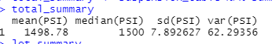
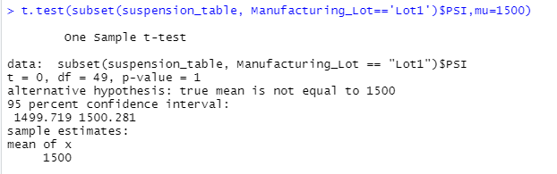

# MechaCar_Statistical_Analysis

## Linear Regression to Predict MPG
In relation to the metrics of the MPG to the other variables of the MechaCar prototypes, when mpg compared against vehicle length, vehicle weight, spoiler angle, ground clearance and AWD, can be determined that the slope is linear with a p-value of 5.35e-11 -- rejecting the null hypothesis since p-value results are lower than 0.05%. The two vairables that provide a non-random amount of variance to the mpg values are vehicle length with a p-value of 2.60e-12 and ground clearance, 5.21e-08. After conducting the different tests in this linear model, it's probable this does predict MPG of the MechaCar prototypes effectively since the evaluations are closest to 0. 

## Summary Statistics on Suspension Coils
Design specifications for the MechaCar suspension coils dictate that the variance of the suspension coild are not to exceed 100 pounds per square inch. Based on the current manufacturing data that was provided to us, as a whole the suspension coils do meet the design specifications with a variance under the 100lb mark of 62.29. But there is something off about the data and in further analysis of each lot, Lot3 has the highest variance and standard deviation demonstrating that there is an error in this lot. The mean and median for Lot3 is close to Lot1 & 2, it's looking at the other tests that we see a difference and will need further testing for aread of interest. 

## T-Tests on Suspensioin Coils

