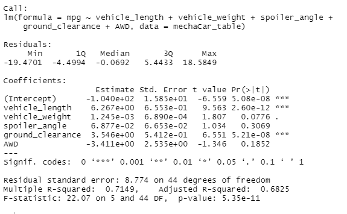
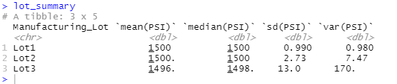
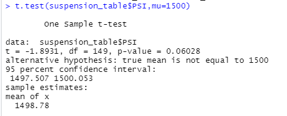
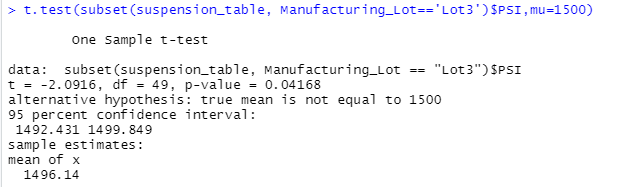

# MechaCar_Statistical_Analysis

## Linear Regression to Predict MPG
In relation to the metrics of the MPG to the other variables of the MechaCar prototypes, when mpg compared against vehicle length, vehicle weight, spoiler angle, ground clearance and AWD, can be determined that the slope is linear with a p-value of 5.35e-11 -- rejecting the null hypothesis since p-value results are lower than 0.05%. The two vairables that provide a non-random amount of variance to the mpg values are vehicle length with a p-value of 2.60e-12 and ground clearance, 5.21e-08. After conducting the different tests in this linear model, it's probable this does predict MPG of the MechaCar prototypes effectively since the evaluations are closest to 0. 

## Summary Statistics on Suspension Coils

## T-Tests on Suspensioin Coils

